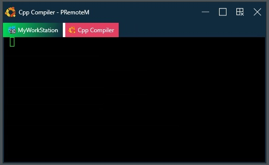
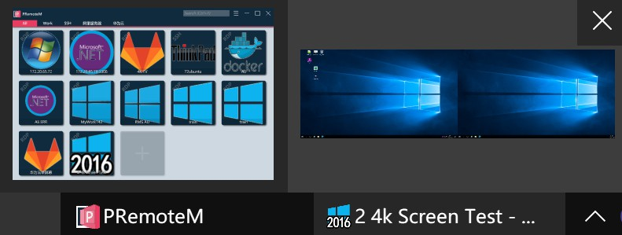
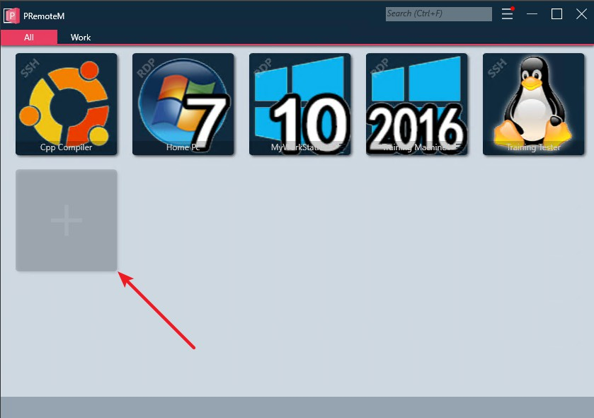
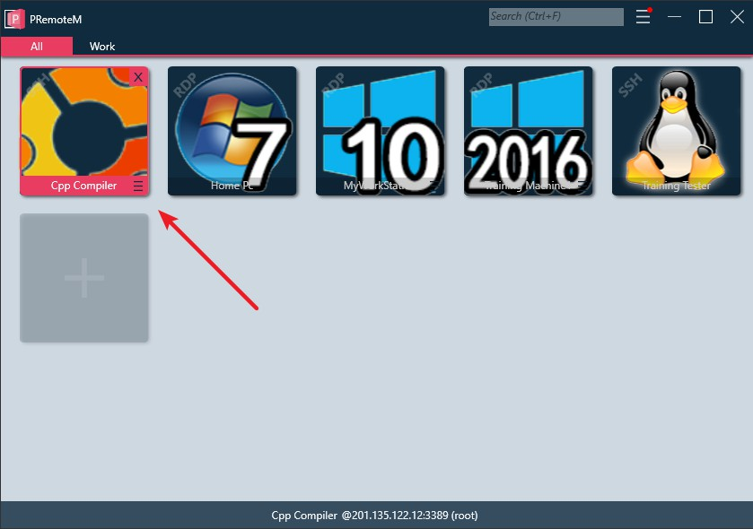
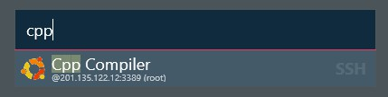
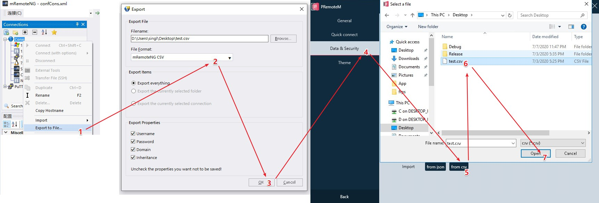
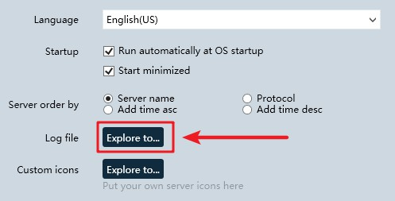

# PRemoteM
<p align="center">
    
</p>

```
PRemoteM = Personal Remote Manager

- :smiley:I am the old user of mRemoteNG.
- :disappointed_relieved:I decided make a new remote tool in WPF after I bought two 4k monitors.
```


PRemoteM is a utility that helps you manage remote sessions with HiDpi multi-screen RDP, SSH, Telnet and others remote protocols in a tab window.


<p align="center">
    
</p>

<p align="center">
    
</p>

<p align="center">
    
</p>


## Featutes
----
- RDP with multi-screen and HiDpi(Testd on **Win10 + 4k*2** to **Win2016**)
- SSH,Telnet support via PuTTY
- Tab support
- UI themes support
- Opening a remote session via shortcut
- [Migare remote connections from mRemoteNG](https://github.com/VShawn/PRemoteM#Migare-from-mRemoteNG)
- [Password can be encrypted by RSA](https://github.com/VShawn/PRemoteM#Encryption)

## Requirements
----
- [.NET Framework 4.8](https://dotnet.microsoft.com/download/dotnet-framework/net48)

## Usage
----
Full instruction

### open remote connection
1. run PRemote.exe.
2. click "+" button to add connection info.
   
    

3. double click the **Server Card** to open a remote session.
   
    

4. or you can open a session by <kbd>Alt</kbd> + <kbd>M</kbd> and keyword.

    

### Encryption
By encrypting data, no one can get your remote password by open database directly.
1. In <kbd>Setting</kbd> -> <kbd>Data & Security</kbd> page
2. click <kbd>Encrypt</kbd> button and select a proper place to store your **Key File**.

### Migare from mRemoteNG


## Make contribution
Help to make this tool more powerful.
Your name woluld be shown below as a contributor.

### Code
- Pull request are welcome.

### Translate
- UI
  - Just duplicate the lang file [en-us.js](https://github.com/VShawn/PRemoteM/blob/master/PRM.Core/Languages/en-us.json), and translate it to your language. 
  - Put your lang file to **C:\Users\YourName\AppData\Roaming\PRemoteM\Languages** for preview.
    - click this button can go to the directory **C:\Users\YourName\AppData\Roaming\PRemoteM**
    
    
  - Share your lang file after job is done.
- Doc
  - [WIP]


## Todo list

- [ ] VNC
- [ ] sFtp
- [ ] upload PRemoteM to Microsoft Store
- [ ] more features
