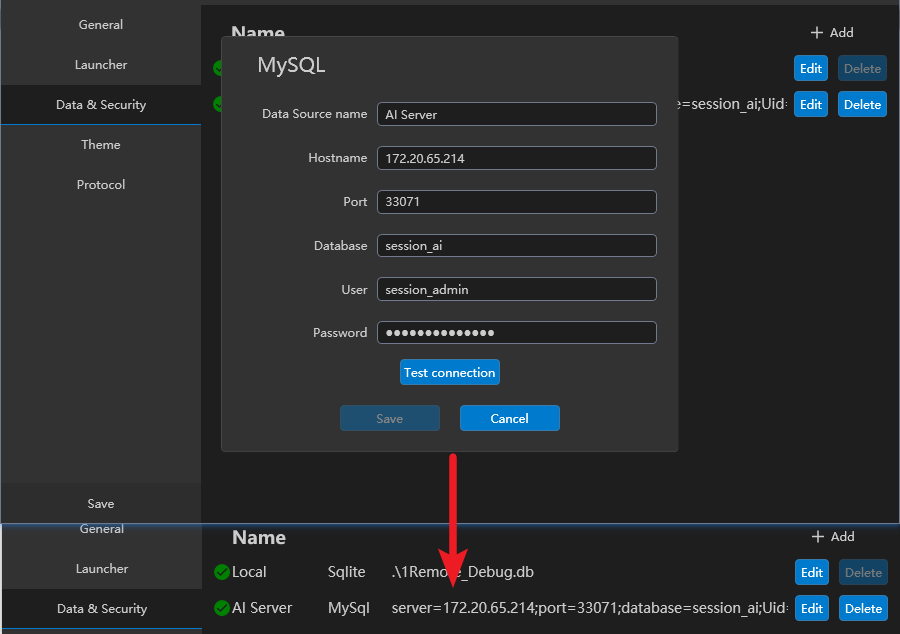

# 多数据源

一个典型的应用场景是你有自己的私人服务器，同事工作中在你的团队中也有服务器需要使用。其中你的私人服务器当然只有你自己一个人管理，但你所在团队的服务器可能有多个人访问，其中有的成员可以修改配置，有的成员则只能使用这些配置开启远程，这时候就需要多数据源支持了。

APP 支持 SQLite 数据库和 MySQL 数据库，其中默认数据源（Local）采用 SQLite 数据库，你可以向其中添加自己不与任何人分享的服务器配置。而你所在团队的服务器配置则可以添加到 MySQL 中，这样你的团队成员添加了这个 MySQL 数据库后，就可以分享这些服务器配置了。

本文以AI算法训练服务器的共享为例，说明数据源模块的使用。

## 数据源配置步骤

1. 安装 MySQL，本文的 MySQL 是使用群晖的套件安装的。
2. 在 MySQL 中新建一个数据库，此处新建了一个叫做 `session_ai` 的数据库，这个数据库中不需要建立任何表。
3. 在 MySQL 中新建一个账户 `session_admin`，并授予其 `session_ai` 数据库的所有权限。
    
4. 在 APP `Setting` -> `Data & Security` 页面右上角，点击 `Add` 按钮，添加一个新的 MySQL 数据库。
    
5. 回到 APP 主页，点击右上角 `+` 按钮，选择添加到新增的数据源 `session_ai` 即可向其中新增服务器配置。
    
6. （可选）在 MySQL 中新建一个账户 `session_user`，并授予其 `session_ai` 数据库的 `select` 权限。将这个用户发放给你的团队成员，他们用这个账户添加数据源后，将得到其中服务器配置的**只读**权限。
    
    

Note: APP将定时查询并同步数据源中数据的更新，你修改数据配置后团队成员可能需要几十秒来进行定时的数据同步。
